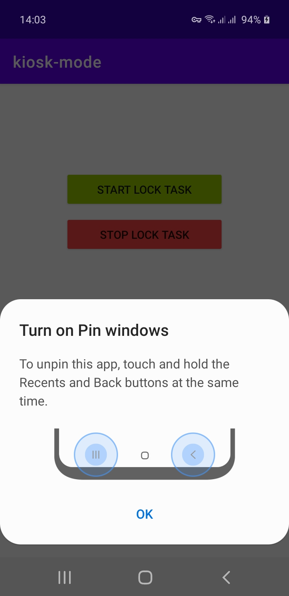

# kiosk-mode

Library for enable and disable kiosk mode on Android.

[](https://jitpack.io/#prongbang/kiosk-mode)

## Preview



## Setup

- `build.gradle`

```groovy
buildscript {
    repositories {
        maven { url 'https://jitpack.io' }
    }
}
```

- `settings.gradle`

```groovy
dependencyResolutionManagement {
    repositories {
        maven { url 'https://jitpack.io' }
    }
}
```

- `app/build.gradle`

```groovy
implementation 'com.github.prongbang:kiosk-mode:1.0.0'
```

## How to use

- New Instance

```kotlin
private val androidDevicePolicyManager by lazy {
    AndroidDevicePolicyManager(
        activity,
        AndroidDeviceAdminReceiver.getComponentName(this)
    )
}
```

- Check Device Owner App

```kotlin
val isDeviceOwner = androidDevicePolicyManager.isDeviceOwnerApp()
```

- Start Lock Task 

```kotlin
androidDevicePolicyManager.startLockTask()
```

- Stop Lock Task

```kotlin
androidDevicePolicyManager.stopLockTask()
```

- Stop Lock Task and Start Activity

```kotlin
androidDevicePolicyManager.stopLockTaskAndStartActivity(MainActivity::class.java)
```

### Set the app as device administrator

```shell
adb shell dpm set-device-owner <applicationId>/.AndroidDeviceAdminReceiver
```

Example

```shell
adb shell dpm set-device-owner com.prongbang.kioskmode/.AndroidDeviceAdminReceiver
```